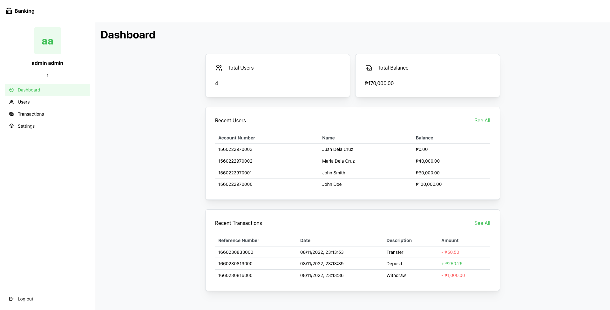
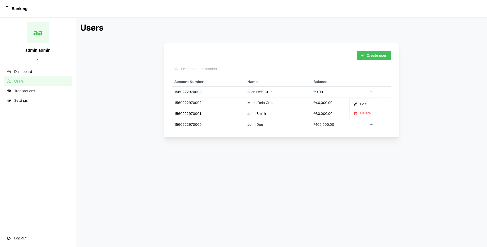
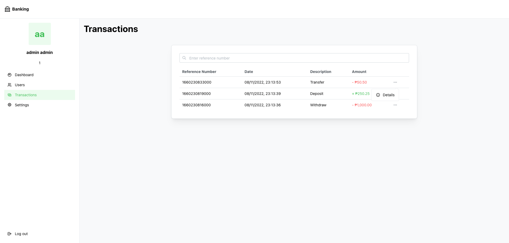
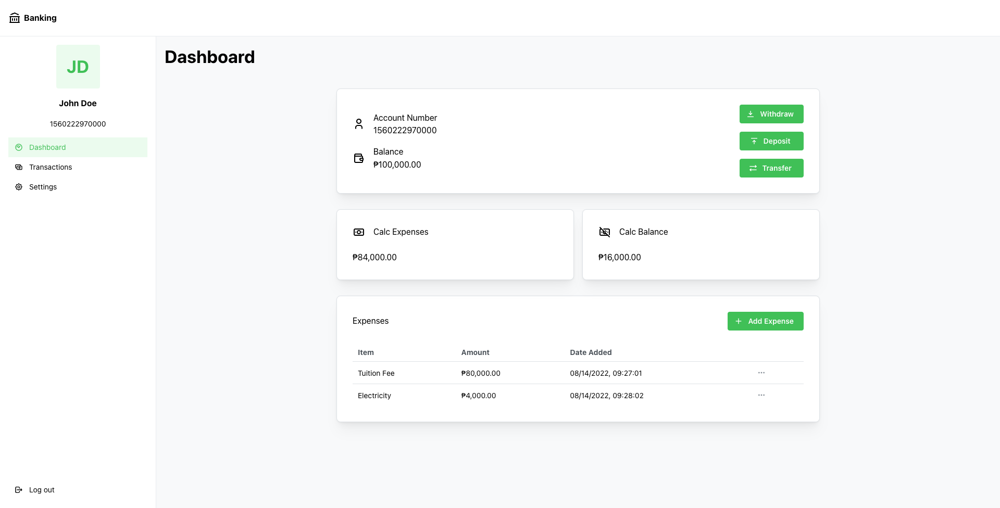
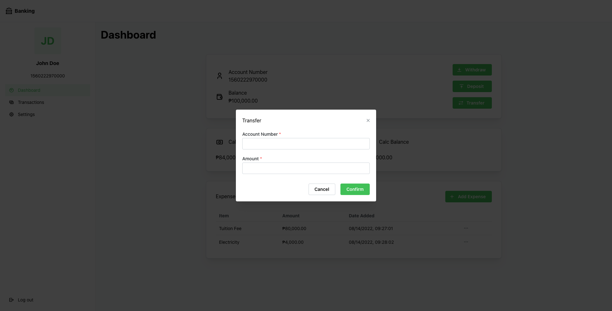
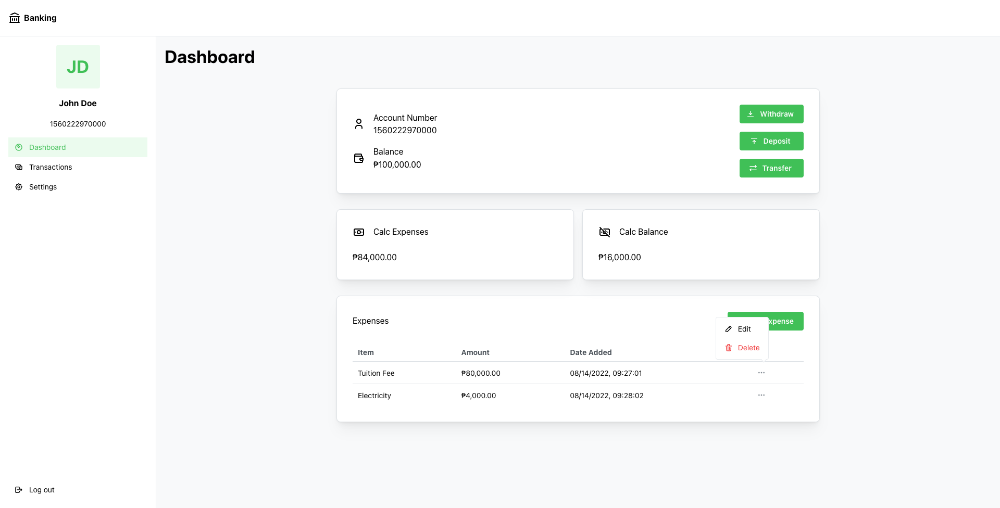

# mantine-banking-app

## Admin

## User

This project is a combination of Banking and Budget web application.

## Tech Stack

- HTML
- SCSS
- React
- Mantine

## Features

### Admin:

- Create, edit, and remove a user
- View all user transactions

## User:

- Create an account
- Withdraw, deposit, and transfer money
- Add, edit, and remove expenses
- View transactions

## Test Accounts

### Admin:

- `email: admin@email.com`  
  `password: admin`

### User:

- `email: jd@email.com`  
  `password: jd`  
  `balance: 100000.0`

- `email: js@email.com`  
  `password: js`  
  `balance: 30000.0`

- `email: mdc@email.com`  
  `password: mdc`  
  `balance: 40000.0`

- `email: jdc@email.com`  
  `password: jdc`  
  `balance: 0.0`

### Live Demo: http://mantine-banking-app.vercel.app/
